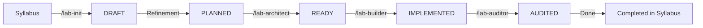

# Laboratory Lifecycle Example

This document illustrates the full journey of a laboratory, from its conception in the Syllabus to its final certification, using the **Agent Workflows**.

## The Scenario
We want to create **LAB-006: Flux & Mono Foundations**.

---

### Step 1: Planning (Phase A)
**Command**: ` /lab-master-plan for Lab 006`

1. **`Init`**: The agent reads the Syllabus (LOs: Reactive Streams, Factories, Lazy execution) and templates. It creates `docs/specs/006-flux-mono-foundations/`.
2. **`Drafting`**: The agent generates a proposal.
   - *Example Scenario*: "Create a stream of sensor data and subscribe to it."
3. **`Architect`**: The agent checks the plan. 
   - *Audit*: "Wait, TR-004 Command Dissection is missing for `StepVerifier`." -> **Agent fixes it automatically.**
4. **Result**: Status changes to **`READY`**.

---

### Step 2: Execution (Phase B)
**Command**: ` /lab-master-build`

1. **`Builder`**:
   - **Scaffold**: Creates `labs/006-flux-mono-foundations/`.
   - **TDD**: Writes `src/test/java/.../FluxMonoTest.java`.
   - **Implementation**: Writes the foundational code.
   - **Documentation**: Generates `README.md` and `CONCEPT.md` explaining the Push model.
2. **`Auditor`**:
   - **Gap Check**: "You used `blockLast()` in the README but didn't explain it in CONCEPT.md." -> **Agent adds the explanation.**
3. **Result**: Status changes to **`AUDITED`**.

---

### Summary of Status Transitions

## How to use Master Workflows
If you prefer a hands-off approach, use these two commands:

1. ` /lab-master-plan`: Get the design done and approved.
2. ` /lab-master-build`: Get the code done and certified.

---
**Version**: 0.1.0
