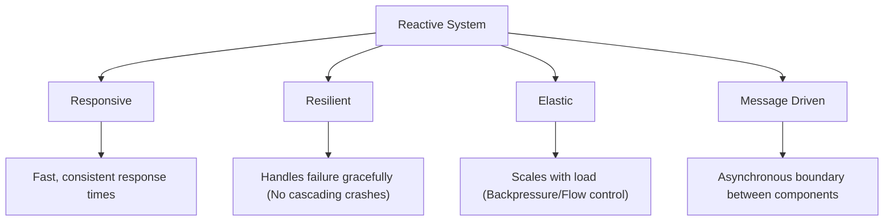

# Concept: The Reactive Manifesto & Asynchronous Foundations

## 1. The Reactive Mindset: Why "Reactive"?
Traditional synchronous systems are **blocking**. In a classic Java application, when a thread requests data (e.g., from a database), it sits idle, consuming ~1MB of stack memory and OS resources while waiting for a response. In high-scale environments, this leads to **Thread Exhaustion**.

**Reactive Programming** flips this model. Instead of waiting (Pull), the system continues execution and is notified when data is ready (Push).

### Thread-per-Request vs. Event-Loop
In the reactive model, we use a small, fixed number of threads (the Event Loop) to handle I/O non-blockingly. If you block one of these threads, you degrade the performance of the entire system. Reactive streams allow us to orchestrate complex async logic while keeping these few threads active and efficient.

## 2. The Reactive Manifesto (The 4 Pillars)
A Reactive System is defined by these architectural characteristics:

| Pillar | Engineering "Why" | Real-World Java Example |
| :--- | :--- | :--- |
| **Responsiveness** | High availability and user trust. | A WebFlux service returning a stream of search results instantly, rather than waiting for the entire set. |
| **Resilience** | System survivability. Errors are signals, not crashes. | Using `onErrorResume` to return a cached value when a downstream microservice is down. |
| **Elasticity** | Resource efficiency. Handling bursts via flow control. | A stream that drops non-essential logging events when the CPU is under heavy load (Backpressure). |
| **Message Driven** | Loose coupling. Asynchronous boundaries. | Decoupling the ingestion of user uploads from the heavy processing (OCR/Compression) using a message queue. |

## 3. The Evolution of Asynchrony in the JVM
| Paradigm | Model | Multi-value? | Termination |
| :--- | :--- | :--- | :--- |
| **Callbacks/Listeners** | Push | Yes | Manual/Hard to track |
| **CompletableFuture** | Push | No | Complete/Exception (Terminal) |
| **Flux / Mono** | Push | **Yes** | onNext* -> (onComplete OR onError) |

### The Observer Pattern Lifecycle
A Reactive Stream represents a flow of data. The relationship is governed by the **Reactive Streams Specification**:

1.  **Subscription**: The consumer (Subscriber) connects to the producer (Publisher).
2.  **Emission (`onNext`)**: The producer pushes data to the consumer.
3.  **Completion (`onComplete`)**: The producer signals successful end of stream.
4.  **Error (`onError`)**: The producer signals a terminal failure.

## 4. The Reactive Landscape: Market Alternatives

While this lab focuses on **Project Reactor** (the engine behind Spring WebFlux), it's important to know the other players in the ecosystem:

| Library / Spec | Primary Backer | Use Case | Key Features |
| :--- | :--- | :--- | :--- |
| **Project Reactor** | VMware (Spring) | Enterprise Java, Spring WebFlux. | Tight Spring integration, high performance, `Flux/Mono`. |
| **RxJava (3.x)** | Netflix | Android, Desktop Apps, Backend. | The pioneer. Very similar to Reactor, but older and more mobile-focused. |
| **SmallRye Mutiny** | Red Hat (Quarkus) | Cloud-native, Quarkus applications. | Different API (`Uni/Multi`), event-loop centric, very guided. |
| **MicroProfile Reactive** | Eclipse Foundation | Jakarta EE / MicroProfile apps. | Standardized specification for reactive messaging and streams. |
| **Akka Streams** | Lightbend | Scala/Java, Distributed systems. | Based on the Actor Model. Heavyweight but extremely powerful for clustering. |

## 5. The Runtime Environment: Tomcat vs. Netty

The shift to reactive programming also changes the underlying server technology.

### Tomcat (Servlet-Based)
*   **Model**: Thread-per-request.
*   **Mechanism**: A thread is pulled from a pool, handles the request (potentially blocking), and returns to the pool.
*   **Limitation**: If you have 1,000 blocking requests, you need 1,000 threads. This consumes significant RAM and causes CPU context-switching overhead.

### Netty (Event-Loop Based)
*   **Model**: Non-blocking Event Loop.
*   **Mechanism**: A tiny number of threads (usually 1 per CPU core) handle thousands of connections. They never wait for I/O; they just register callbacks and move on.
*   **Strength**: Extremely high throughput and low memory footprint. This is the default runtime for **Spring WebFlux**.

> **Crucial Rule**: In Netty, **NEVER BLOCK**. If you block an event-loop thread, you are blocking hundreds of other requests sharing that same thread.

---

## 6. Why Project Reactor Wins
Unlike Futures, Project Reactor types (`Flux` and `Mono`) are **Lazy** (they don't start until you subscribe) and **Cancellable**. They provide a rich set of operators to transform, filter, and combine streams, allowing you to treat "Time" as just another dimension of your data.
