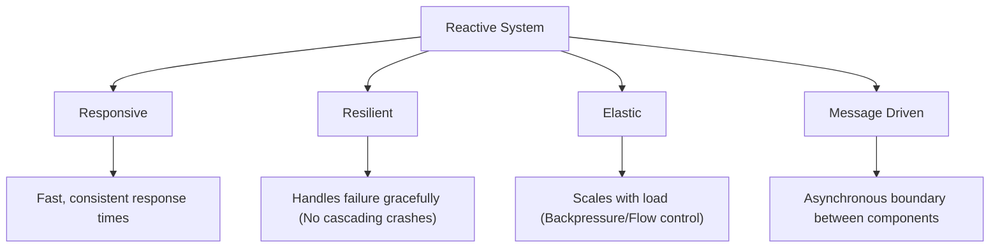

# Concept: The Reactive Manifesto & Asynchronous Foundations

## 1. The Reactive Mindset: Why "Reactive"?
Traditional synchronous systems are **blocking**. When a thread requests data (e.g., from a database), it sits idle, consuming memory and resources while waiting for a response. In high-scale environments, this leads to thread exhaustion.

**Reactive Programming** flips this model. Instead of waiting (Pull), the system continues execution and is notified when data is ready (Push).

### The Event Loop vs. Blocking Threads
In the Node.js environment, the **Event Loop** is the engine. It handles I/O non-blockingly. If you block the loop, you block the world. Reactive streams allow us to orchestrate complex async logic while keeping the Event Loop spinning efficiently.

## 2. The Reactive Manifesto (The 4 Pillars)
A Reactive System is defined by these architectural characteristics:

| Pillar | Engineering "Why" |
| :--- | :--- |
| **Responsiveness** | High availability and user trust. |
| **Resilience** | System survivability. Errors are signals, not crashes. |
| **Elasticity** | Resource efficiency. Handling bursts via flow control (Backpressure). |
| **Message Driven** | Loose coupling. Producers don't need to know who the consumers are. |

## 3. The Evolution of Asynchrony
| Paradigm | Model | Multi-value? | Termination |
| :--- | :--- | :--- | :--- |
| **Callbacks** | Push | Yes | Manual/Hard to track |
| **Promises** | Push | No | Resolve/Reject (Terminal) |
| **Observables** | Push | **Yes** | onNext* -> (onComplete OR onError) |

### The Observer Pattern Lifecycle
An Observable represents a stream of data. The relationship is governed by the **Observer Pattern**:

1.  **Subscription**: The consumer (Observer) connects to the producer (Observable).
2.  **Emission (`onNext`)**: The producer pushes data to the consumer.
3.  **Completion (`onComplete`)**: The producer signals successful end of stream.
4.  **Error (`onError`)**: The producer signals a terminal failure.

## 4. Why Observables Win
Unlike Promises, Observables are **Lazy** (they don't start until you subscribe) and **Cancellable**. They provide a rich set of operators to transform, filter, and combine streams, allowing you to treat "Time" as just another dimension of your data.
