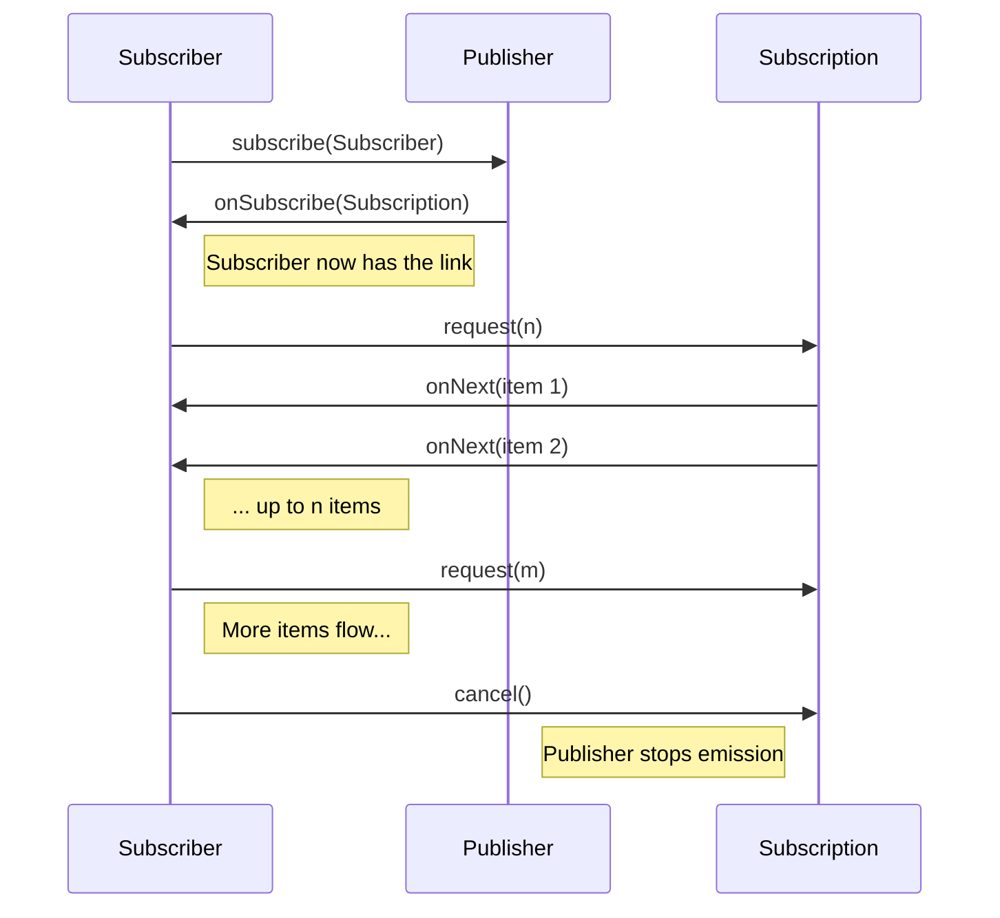

# CONCEPT: The Reactive Streams Specification

The Reactive Streams Specification is a standard for asynchronous stream processing with non-blocking backpressure. It was created to allow different reactive libraries (Reactor, RxJava, Akka Streams) to interoperate seamlessly.

## The 4 Core Interfaces

The entire specification is built on just four interfaces:

1.  **Publisher<T>**: The provider of a potentially unbounded number of sequenced elements.
2.  **Subscriber<T>**: The consumer of elements, which signals demand to the Publisher.
3.  **Subscription**: The "link" between a Publisher and a Subscriber. It manages demand (`request`) and allows cancellation.
4.  **Processor<T, R>**: A component that is both a Subscriber and a Publisher (a transformer).

## The Handshake Lifecycle

The most critical part of the specification is the "Handshake". No data is allowed to flow until the Subscriber explicitly requests it.

## The "Demand" Model (Backpressure)

Backpressure in Reactive Streams is **pull-based**. 

*   **Fast Producer / Slow Consumer**: Without backpressure, a fast producer would overwhelm a slow consumer, leading to `OutOfMemoryError` or dropped packets.
*   **The Solution**: The Subscriber maintains control. It tells the Publisher: "I am ready for exactly 5 more items." The Publisher MUST NOT send more than 5 items until the next `request` call.

### Key Rules of the Specification

*   **Rule 1.1**: A Publisher must signal `onNext` only after a Subscription exists and demand (`request`) has been signaled.
*   **Rule 3.3**: `Subscription.request` must be additive. If a subscriber calls `request(2)` and then `request(3)`, the total demand is 5.
*   **Rule 3.5**: `Subscription.cancel` must be idempotent and must stop all signals to the subscriber.
*   **Rule 3.9**: `Subscription.request(n)` where `n <= 0` must result in an `onError` signal with an `IllegalArgumentException`.

## The TCK (Technology Compatibility Kit)

The TCK is a test suite that verifies if an implementation correctly follows all the complex rules of the specification. It handles concurrency, boundary conditions, and edge cases that are difficult to test manually.
