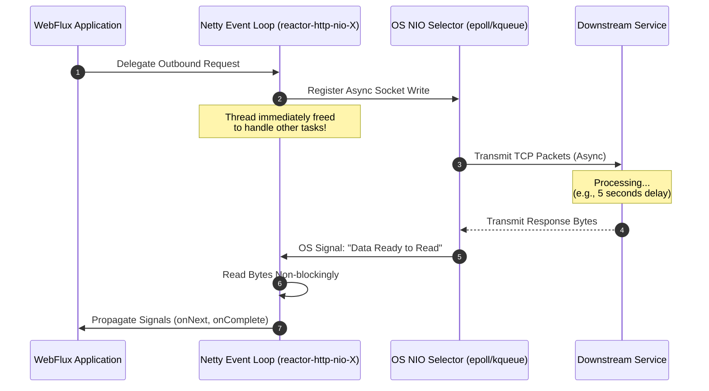
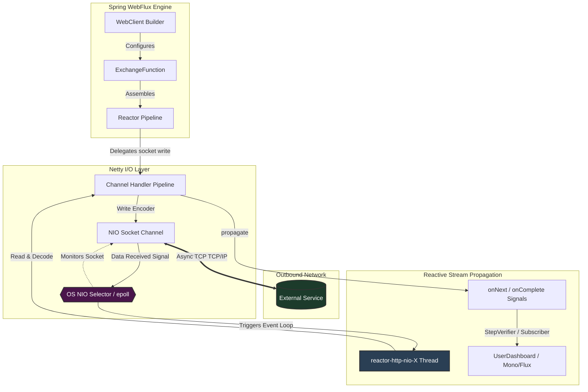

# Concept: WebClient & Reactive Orchestration

In modern microservices architectures, services must communicate with high throughput and low resource utilization. Traditional Java environments rely on synchronous blocking calls, which severely limit scaling. Project Reactor and Spring WebFlux solve this via **WebClient**, a fully non-blocking, reactive HTTP client.

---

## 1. Under the Hood: Thread-per-Request vs. Event-Loop Delegation

To appreciate `WebClient`'s efficiency, we must contrast it with the traditional synchronous model:

### A. The Traditional Model: Thread-per-Request (e.g., `RestTemplate` / Tomcat)
In a standard servlet container, each incoming request is bound to a dedicated worker thread (e.g., `http-nio-8080-exec-1`).
- **Hostage Thread**: When making an outbound HTTP request using `RestTemplate`, the worker thread sends the request, then **blocks** on socket read operations (e.g., inside `SocketInputStream.socketRead0()`).
- **Idle Waste**: The thread enters a `WAITING` state, frozen until the external API returns a response. While waiting, it cannot handle other tasks.
- **Vulnerability**: If the downstream service takes 5 seconds, that thread is completely dead to the system for 5 seconds. Under load, the thread pool quickly exhausts, leading to request timeouts and cascade failure.

### B. The Reactive Model: Event-Loop Delegation (e.g., `WebClient` / Netty)
`WebClient` is built on top of **Project Reactor Netty**. It operates on a tiny pool of **Event Loop threads** (typically equal to the number of CPU cores), named **`reactor-http-nio-X`**:
- **Delegation**: When you call `WebClient`, the initiating thread constructs the pipeline and delegates the network request to Netty.
- **Immediate Release**: Netty performs an asynchronous socket write. The event loop thread is **immediately released** back to the loop to process hundreds of other concurrent requests. It does *not* wait around.
- **NIO Selector**: The operating system's network stack monitors the socket. When downstream data arrives, the OS triggers a notification via a non-blocking `Selector` (e.g., `epoll` on Linux, `kqueue` on macOS).
- **Callback Execution**: The `Selector` wakes up a `reactor-http-nio-X` thread to read the bytes non-blockingly, pass them through the Netty Channel Handler Pipeline, and propagate the `onNext`/`onComplete` signals down the Reactor pipeline.



---

## 2. Mermaid Architecture: The WebClient Lifecycle

The visual flow of data from request assembly down to stream subscription is governed by Netty's channel handler pipeline and Reactor's reactive engine:



---

## 3. Connection Pooling & Implicit Backpressure

`WebClient` relies on a Netty `ConnectionProvider` to manage a pool of active physical connections (HTTP Keep-Alive).

### A. Pool Limits & Resource Control
- **`maxConnections`**: The maximum number of physical channels allowed.
- **`pendingAcquireTimeout`**: If all connections are in use, new requests enter an acquire queue. If no connection is freed within this timeout, Netty throws a `PoolAcquireTimeoutException`.
- **Resource Leaks**: Properly consuming the response body is crucial. If you use `exchangeToMono()` but fail to consume the body (via `bodyToMono` or `releaseBody()`), the connection **will not return to the pool**. It remains "leaked" until timed out, exhausting the pool.

### B. Interplay with Backpressure
1. **Upstream Demand**: Project Reactor operates on a pull-based model (Subscriber requests $N$ elements).
2. **Netty Socket Buffer**: If the downstream service sends data faster than the WebClient subscriber can consume it, Netty stops reading from the TCP socket.
3. **TCP Flow Control**: The TCP window size shrinks, signaling the downstream service's OS network stack to pause packet transmission.
4. **Natural Throttle**: This chain forms an elegant, end-to-end non-blocking flow control loop, completely avoiding memory buffers overflow.

---

## 4. `retrieve()` vs. `exchangeToMono()`: Memory Safety Invariance

Choosing the right API determines the memory safety of your application:

| Feature | `retrieve()` (The Safe Default) | `exchangeToMono()` / `exchangeToFlux()` |
| :--- | :--- | :--- |
| **Direct Access** | Exposes body directly (`bodyToMono`, etc.) | Exposes `ClientResponse` (Headers, Status, Cookies) |
| **Memory Management** | **Automatic**: Spring consumes/discards the body and releases the connection safely. | **Manual**: The developer MUST consume or release the body explicitly. |
| **Risk of Connection Leaks** | Extremely Low | **High**: Forgetting `.releaseBody()` on error causes connection leaks. |
| **Best Used For** | 90% of standard HTTP GET/POST integrations. | Advanced routing based on headers before body parsing. |

### The Silent Hazard: Error Response Starvation
When using `exchangeToMono()`, Spring WebFlux does **not** treat HTTP 4xx or 5xx status codes as pipeline errors. The `ClientResponse` object is returned successfully, and the connection remains allocated to hold the socket bytes.

If your code only validates custom success headers (e.g., checking token headers on `200 OK`) but ignores server error branches (e.g., leaving a `500 Internal Server Error` unread), the response bytes are never read and the connection is **leaked**. Over time, Netty's connection pool becomes starved of active connections, and all future outbound calls freeze, eventually failing with a `PoolAcquireTimeoutException`. 

To prevent this, you **MUST** ensure that every possible logical branch in your `exchangeToMono` handler terminates by either:
1. Decoding the body (e.g., `response.bodyToMono(Class)`)
2. Explicitly discarding the body (e.g., `response.releaseBody()`)

---

## 5. Reactive Operator Ordering: Timeout vs. Retry Scope

A major source of production bugs in reactive orchestration is the **ordering of operators** in the publisher chain. Where you place `.timeout()` relative to `.retryWhen()` changes the resilience behavior entirely:

### A. Per-Attempt Timeout (Timeout BEFORE Retry)
```java
webClient.get()
    .uri("/inventory/{id}", productId)
    .retrieve()
    .bodyToMono(String.class)
    .timeout(Duration.ofSeconds(2)) // <-- Timeout per-attempt!
    .retryWhen(Retry.backoff(3, Duration.ofMillis(100)));
```
- **Mechanics**: The `.timeout()` operator is close to the source. It monitors each individual network transaction. If any single attempt takes longer than 2 seconds, it throws a `TimeoutException`.
- **Propagation**: The `TimeoutException` triggers the downstream `.retryWhen()` operator, which intercepts it, schedules a backoff delay, and starts the next attempt.
- **Use Case**: Best for mitigating flaky or slow connections by automatically trying another socket if a single request hangs.

### B. Global Pipeline Timeout (Timeout AFTER Retry)
```java
webClient.get()
    .uri("/inventory/{id}", productId)
    .retrieve()
    .bodyToMono(String.class)
    .retryWhen(Retry.backoff(3, Duration.ofMillis(100)))
    .timeout(Duration.ofSeconds(2)); // <-- Global pipeline timeout!
```
- **Mechanics**: The `.timeout()` operator is at the end of the chain. It monitors the *entire combined transaction*, including the initial call, all retry delays, and subsequent attempts.
- **Propagation**: If the sum of all attempts and backoff delays exceeds 2 seconds, the global timeout fires immediately, aborting the stream and preventing further retries.
- **Use Case**: Crucial for enforcing strict Service Level Agreements (SLAs). If an API gateway must respond to a user in under 2 seconds, retrying beyond that limit is useless and wastes downstream thread capacity.

---

## 6. Modern Technology Assimilation: WebClient vs. Virtual Threads (Project Loom)

Java 21+ introduces **Virtual Threads** (Project Loom), which are extremely cheap, user-mode threads scheduled by the JVM onto a pool of carrier threads (OS threads). This challenges the traditional reactive event loop.

### A. Virtual Threads (`RestClient` / Synchronous Blocking)
- **Concept**: You write standard, blocking synchronous code. When a blocking call is made, the JVM yields the Virtual Thread, unmounting it from the **Carrier Thread** so that another Virtual Thread can run on it.
- **Strength**: Code is easy to write, read, and debug (traditional stack traces).

### B. The Silent Threat: Carrier Thread Pinning
Virtual Threads suffer from **Pinning** under two major conditions:
1. When execution occurs inside a `synchronized` block or method.
2. When executing native code (e.g., JNI or some operating system interactions).

When a Virtual Thread blocks on I/O while pinned, the **Carrier Thread is also blocked**. If multiple virtual threads pin all carrier threads, the JVM's ForkJoinPool scheduler stalls, causing severe bottlenecks. Many legacy libraries (e.g., logging frameworks, older database drivers) still contain extensive `synchronized` blocks.

### C. Why WebClient Remains Superior for Complex Orchestration
While Virtual Threads simplify simple "Fetch A and return" tasks, `WebClient` and the reactive model are superior in advanced microservice gateways because:
1. **Complex Orchestration**: Declaratively composing parallel (`zip`), sequential (`flatMap`), fallback, and event streaming pipelines is incredibly clean in Project Reactor. Doing this with Virtual Threads requires verbose manual concurrency constructs (e.g., `StructuredTaskScope`).
2. **True Non-Blocking Execution**: WebClient/Netty operates on pure event-driven NIO loops. There is **zero risk of thread pinning** since there are no blocking calls or unmounting operations.
3. **Built-in Resilience**: Project Reactor provides rich, thread-safe resilience operators (`timeout()`, `retryWhen()`, `onErrorResume()`) out of the box, which must be hand-coded or managed via external libraries in synchronous environments.

