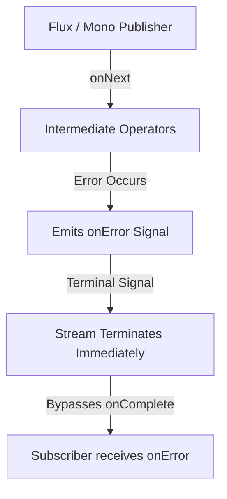

# CONCEPT: Error Handling & Resilience in Spring WebFlux

Reactive stream execution requires a fundamental paradigm shift from traditional imperative programming. In standard MVC architectures, synchronous execution allows thread-per-request blocking and `try-catch` structures. In reactive, asynchronous architectures (WebFlux and Project Reactor), execution boundaries cross multiple physical or virtual threads on an event-loop system. Therefore, managing failures and metadata requires highly specific reactive mechanisms.

---

## 1. The Asynchronous Error Signal Pipeline

In reactive streams, errors are treated as **terminal signals** that propagate down the reactive chain:



When a failure is thrown:
1. The operator that failed halts its output stream and emits an `onError` signal.
2. The signal propagates downstream immediately, bypassing standard execution flow.
3. The stream terminates. Once a stream sends `onError` or `onComplete`, no further elements can ever be emitted. It is mathematically closed.

---

## 2. Pipeline Fallback & Recovery Strategies

To make pipelines resilient, we must intercept error signals before they terminate the stream.

### A. Local Fallbacks with `onErrorReturn`
Replaces an `onError` signal with a pre-configured static fallback value. The stream completes successfully by substituting the terminal error signal with a valid element.
```java
Mono.error(new RuntimeException("Database Timeout"))
    .onErrorReturn("Default Cached Content"); // Emits string and completes 200 OK
```

### B. Resilient Flow Switching with `onErrorResume`
Accepts a function that map-converts the incoming error into a fallback **Publisher**. This is used to dynamically execute an alternative asynchronous flow, such as querying a secondary caching node (Redis) or secondary database cluster.
```java
Mono.error(new RuntimeException("Primary Service Down"))
    .onErrorResume(throwable -> fetchFromCacheBackup());
```

---

## 3. Resilience Operators

### A. Execution Timeouts (`timeout()`)
Guards the system against sluggish external dependencies and prevents thread-starvation on the event loop. If the upstream publisher does not emit an element or signal within the configured duration, it generates a `TimeoutException` signal.
```java
service.fetchOrderDetails()
    .timeout(Duration.ofSeconds(1)); // Prevents blocking Netty workers indefinitely
```

### B. Intelligent Backoff Retries (`retryWhen()`)
Allows automated self-healing of transient networking issues. Rather than failing immediately, it triggers re-subscription. Using **Exponential Backoff with Jitter** prevents "thundering herd" conditions on recovering upstream microservices.
```java
serviceCall()
    .retryWhen(Retry.backoff(3, Duration.ofMillis(100))
        .jitter(0.75)
        .filter(ex -> ex instanceof ServiceUnavailableException));
```

---

## 4. RFC 7807: Problem Details Customization

Under Spring Boot 3+ and WebFlux, standard error representation relies on **RFC 7807 (Problem Details for HTTP APIs)**. The `ProblemDetail` object decouples exception messages from serialization formats, returning structured JSON response schemas with standardized fields (`type`, `title`, `status`, `detail`).

In this laboratory, our global handler customizes the response schema by injecting a dynamic `correlation_id` to trace client requests across distributed logs.

---

## 5. WebFlux Exception Handler Hierarchy

Error resolution operates at three distinct, layered boundaries:

| Precedence | Level | Mechanism | Scope |
| :--- | :--- | :--- | :--- |
| **1 (Highest)** | Pipeline Level | `onErrorReturn` / `onErrorResume` | Localized to a single database or client stream. |
| **2** | Controller Level | `@RestControllerAdvice` + `@ExceptionHandler` | Resource-specific business exceptions (e.g., `ProductNotFoundException`). |
| **3 (Lowest)** | Global Level | `AbstractErrorWebExceptionHandler` | Catches unhandled filters, security, or generic JVM runtime exceptions. |

---

## 6. Reactor Context Architecture & Thread-Hopping

Traditional enterprise frameworks rely on `ThreadLocal` storage (e.g., Spring Security Context, MDC logging) to pass request trace metadata implicitly down the call stack. 

However, in WebFlux, Netty handles requests on a small pool of Event-Loop worker threads. A single request pipeline will **hop** across several physical threads during asynchronous I/O completion:

```
Request Thread A (WebFilter) -> Netty EventLoop (I/O Wait) -> Scheduler Thread B (Map/Filter)
```

Because threads are shared concurrently across thousands of active requests, using `ThreadLocal` will corrupt thread memory and leak request metadata.

### The Reactor Solution: `Context`
Reactor provides an immutable `Context` containing key-value metadata. The Context is tied directly to the **Subscription**, not the physical Thread.

> [!IMPORTANT]
> **Upstream Context Propagation Flow**:
> In Project Reactor, `contextWrite` propagates **upstream** (towards the source of the publisher chain). It is written from the **Subscriber** up towards the **Source**.
> 
> Due to this directionality, a `contextWrite` defined in a `WebFilter` is visible to handlers *upstream* of it (e.g., Controllers, Service beans). However, global `WebExceptionHandler` beans are executed *downstream* in WebFlux's server-adapter error resolution flow (`HttpWebHandlerAdapter`), making the Reactor Context empty at that boundary.
> 
> **Architectural Resolution**: We implemented a hybrid resolution pattern in `GlobalErrorWebExceptionHandler`. It attempts to read the `correlation_id` from the **Reactor Context** first, falling back gracefully to the request-scoped **ServerWebExchange Attributes** for global mapping events.

---

## 7. Evolution: Reactor Context vs. Scoped Values (Java 21+)

As the JVM matures, **Java 21+ introduces Project Loom's Virtual Threads** and **Scoped Values** (`ScopedValue<T>`) as a modern alternative to expensive `ThreadLocal` allocations.

```java
// Java 21+ Scoped Value Injection
ScopedValue.where(TRACE_ID, "test-trace-abc").run(() -> {
    businessService.execute(); // TRACE_ID is implicitly readable
});
```

### Technical Contrast

| Aspect | Reactor Context | Scoped Values (Java 21+) |
| :--- | :--- | :--- |
| **Target Architecture** | Asynchronous Reactive Event-Loops | Imperative Virtual Thread Blocks |
| **Data Flow** | Upstream (Subscriber to Publisher) | Downstream (Parent Stack Frame to Child) |
| **Mutability** | Completely Immutable (returns new context) | Immutable within scope duration |
| **Cross-Thread Safety** | Designed for arbitrary thread hopping | Tied to virtual thread call stacks |

### Curriculum Frontier Rule
While Scoped Values provide memory savings and clean context bounds for virtual-thread blocking code, they are structurally incompatible with highly optimized reactive pipelines. In WebFlux, **Reactor Context** remains the primary and only safe design pattern to pass telemetry across event-loop boundaries.
